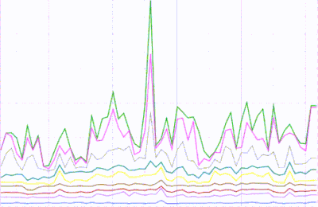
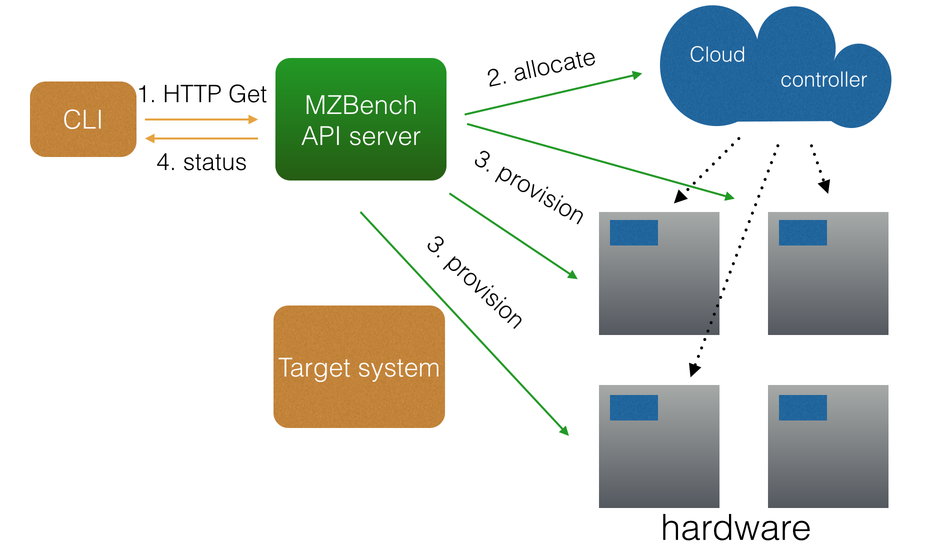
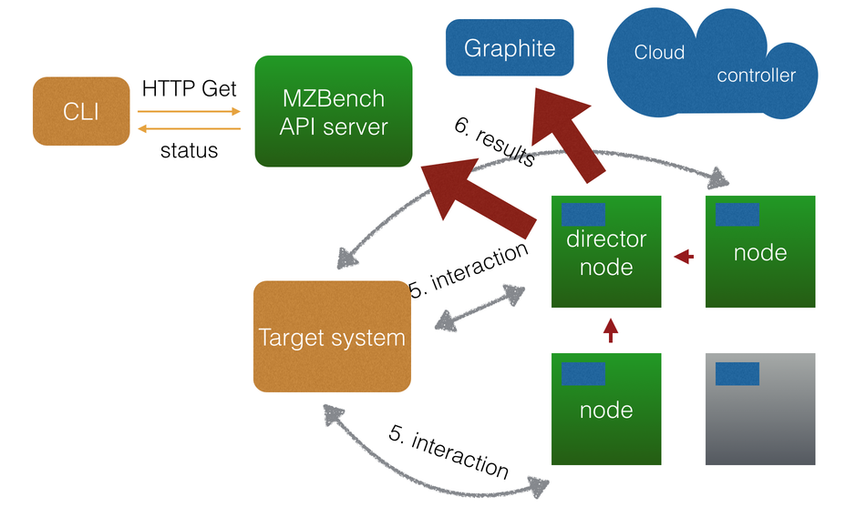

# Welcome to MZBench

***Expressive, scalable load testing tool***

---



**MZBench** helps software testers and developers test their products under huge load. By testing your product with MZBench before going to production, you reduce the risk of outages under real life highload. 

MZBench runs test scenarios on many machines simultaneously, maintaining millions of connections, which make it suitable even for large scale products.

MZBench is:

 - **Cloud-aware:** MZBench allocates nodes directly from Amazon EC2. 
 - **Scalable:** tested with 100 nodes and millions of connections.
 - **Extendable:** write your own [cloud plugins](cloud_plugin#how-to-write-a-cloud-plugin) and [workers](workers.md#how-to-write-a-worker). 
 - **Open-source:** MZBench is released under the [BSD license](https://github.com/machinezone/mzbench/blob/master/LICENSE).


## Installation

To use MZBench, you'll need:

 - Erlang >= 17.1
 - C++ compiler
 - Python 2.6 or 2.7 with pip

Most UNIX systems have C++ compiler and Python preinstalled.

Erlang is available in the [official repositories on most GNU/Linux distros](http://pkgs.org/search/erlang). If your distro doesn't have Erlang R17, [build it from source](http://www.erlang.org/doc/installation_guide/INSTALL.html).  

Download MZBench from GitHub and install Python requirements:

```bash
$ git clone https://github.com/machinezone/mzbench
$ sudo pip install -r mzbench/requirements.txt 
```

## Quickstart

Start the MZBench server on localhost:

```bash
$ cd mzbench
$ ./bin/mzbench start_server
Executing make -C /path/to//mzbench/bin/../server generate
Executing /path/to//mzbench/bin/../server/_build/default/rel/mzbench_api/bin/mzbench_api start
```

!!!note
    The first server start takes a few minutes. The shell will not respond, which is OK; please be patient. Further starts will be much faster.

When the server is running, launch an example benchmark:

```bash
$ ./bin/mzbench run examples/ramp.erl
{
    "status": "pending", 
    "id": 6
}
status: running                       00:09
```

Go to [localhost:4800](http://localhost:4800) and see the benchmark live status:


## How It Works

MZBench runs your test scenarios on many *nodes*, simultaneously. This allows it to put extraordinarily high load on the target system—we're talking about *millions* of simultaneous connections here.

**Node** is a machine, virtual or physical, that runs your scenarios. In real-life testing, MZBench is used with a cloud service like Amazon EC2 that provides nodes on demand. Alternatively, you can manually list the available node hosts. Anyway, you have to provide MZBench the machines to run on. If there's not enough nodes to run all the jobs at the same time, MZBench evenly distributes the jobs between the available nodes.

There's one node that doesn't run scenarios—the **director node**. It collects the metrics from the other nodes and runs [post and pre hooks](scenarios.md#pre_hook-and-post_hook). So, if you want to run jobs on 10 nodes, reserve 11.



When the MZBench server runs your scenarios, it allocates the nodes, prepares them, and distributes the jobs. During the test run, the nodes send the collected data to the director node which then submits them to the server. The server uses the data to render graphs and show stats:



To know what kind of jobs MZBench can run, it's important to understand the concept of a *worker*.

**Worker** is an Erlang module that provides functions for test scenarios. A worker may implement a common protocol like HTTP or XMPP, or a specific routine that is relevant only for a particular test case. It also implements the related metrics.

MZBench ships with workers for [HTTP](https://github.com/machinezone/mzbench/tree/master/workers/http) and [XMPP](https://github.com/machinezone/mzbench/tree/master/workers/xmpp) protocols and a worker that [executes shell commands](https://github.com/machinezone/mzbench/tree/master/workers/exec). This should be enough for most common test cases, but you can use your own workers in necessary.


## Read Next

 - [How to write scenarios →](scenarios.md)
 - [How to control MZBench from command line →](cli.md)
 - [How to deploy MZBench →](deployment.md)
 - [How to write your own worker →](workers.md#how-to-write-a-worker)
 
